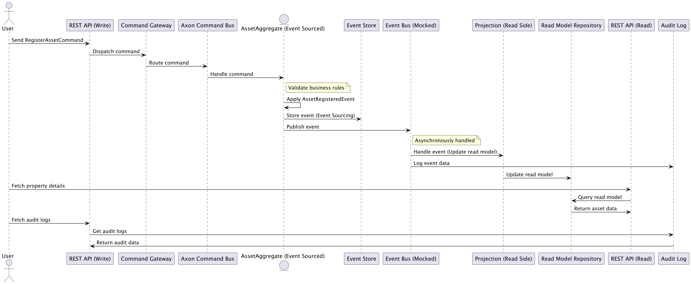

### Purpose
Demonstrates how CQRS, Event sourcing can be implemented using Axon.

### Running locally
Start the server, application runs on default port 8080
To use swagger, http://localhost:8080/swagger-ui/index.html

### Domain
To keep it simple imagine we are managing an asset, there might be several properties but let's just
update the name for simplicity. 
* AssetId UUID
* Asset name String

### Flow
Created using PlantUML (see architecture.puml)

### Axon
Axon is responsible for handling CQRS and Event Sourcing, ensuring that commands and queries are separate. 
It also helps manage event-driven communication between different parts of the system.

#### Terminology

##### Aggregation
It represents a collection of related objects (like entities) that should be manipulated together. 
This is helpful because in DDD, consistency and business logic are usually encapsulated within an Aggregate.

##### Transactional boundary
It also defines a boundary for transactions and state changes, meaning that you typically apply commands to an 
Aggregate root, which then performs state changes or emits events.

#####  Event Store
A repository for events, which represent the changes that occurred in aggregates over time.

##### Aggregate in Axon
* Is the entry point for changes to an entity’s state.
* Maintain invariants and rules for business logic.
* Emit events when changes happen, and these events are then stored in an Event Store.

#### Axon flow (in our application)

| Step                    | Axon component                     |  Operation |
|-------------------------|------------------------------------| -----------|
| Command received        | CommandGateway                     | Routes command to the correct aggregate.|
| Command processing      | @CommandHandler in Asset           | Applies an event. |
| Event emission          | apply(new A..Event())              | Axon publishes the event. |
| Event handling in Query | @EventHandler in AssetEventHandler | Updates the read model. |
| Query processing        | Query API in QueryController       | Returns data from the read model.

